# Serverless AKS? Maybe possible but not worth the price...

I was curious if by using Virtual-Kubelets if it will be possible to create a Serverless AKS cluster. Here my insights:

## Starting Point
I used my Terraform [template](https://github.com/h2floh/IaC/tree/h2floh/aksvirtualnode) to create an AKS Cluster with one B2s agent node and the new built-in **virtual-node** feature.<br/>
Turns out this feature is a virtual-kubelet deployed within the `kube-system` namespace.
<br/><br/>
I will call the real AKS VM agent node from now on just **node** and all virtual-nodes **virtual-node**.

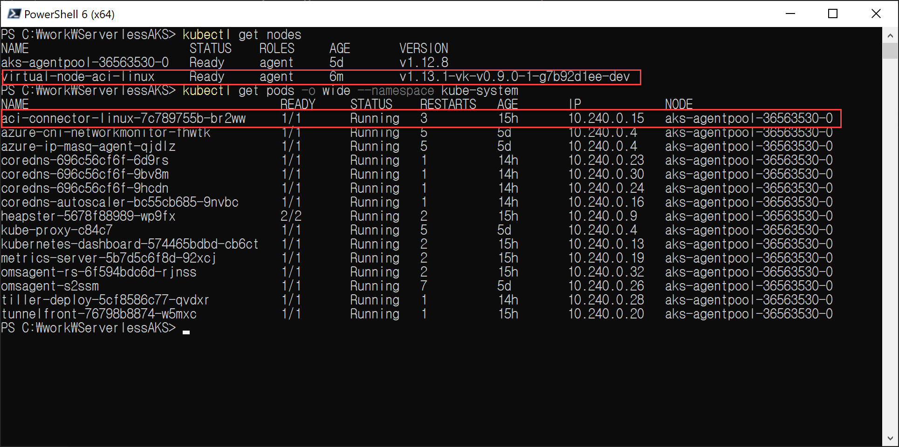

## First Test

Creating a pod on the virtual-node and then drain the node. I am using the simple yaml example on Microsoft Docs [here](https://docs.microsoft.com/en-us/azure/aks/virtual-nodes-portal#deploy-a-sample-app) and saved it in a file called _test.yaml_.
```
kubectl apply -f .\test.yaml
```
After some time we can see that the pod is running (red part) and that it was created within ACI in the Azure Portal as well.
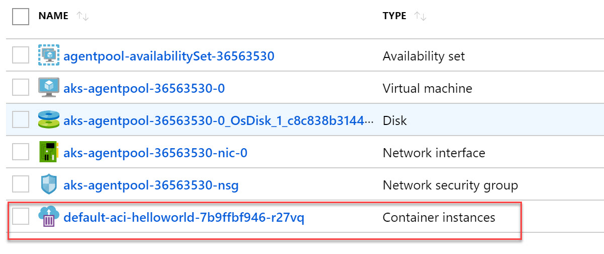
```
kubectl get pods -o wide
```
Ok now we drain the node to see what happens (purple part). Oh errors... does not sounds too healthy that we have to override deamon-sets and delete local data... but I will do.<br/>
```
kubectl drain aks-agentpool-36563530-0 --ignore-daemonsets --delete-local-data
```
The result is, the pod on the virtual-node is still running, but the virtual-node vanished from the node overview (orange part). 
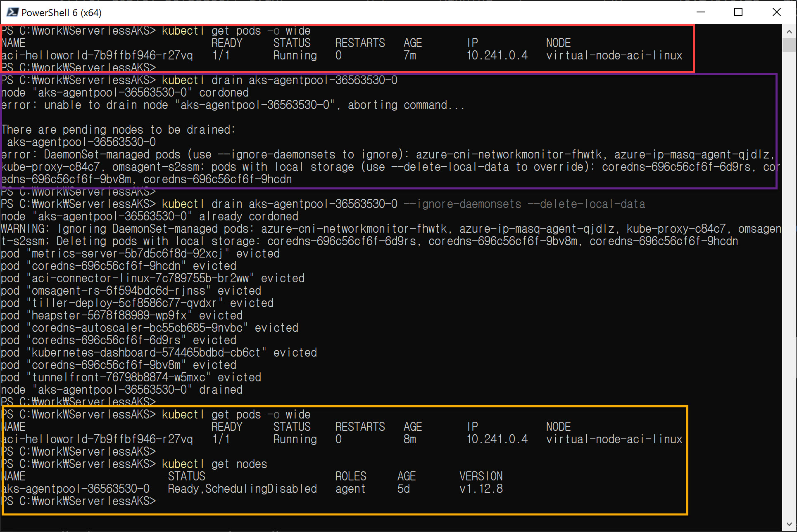

This is because the _virtual-kubelet pod_ for providing the virtual-node is pending because it can not be placed anywhere.
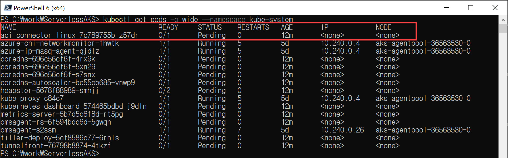
<br/>
Good! So what if we run a virtual-kubelet on top of the virtual-node? Sounds crazy right!?
<br/>
But first some necessary cleanup to get things to normal:
```
kubectl uncordon aks-agentpool-36563530-0
```

## How to deploy virtual-kubelet on a virtual-node

To shorten things a little, we can not use the Azure CLI variant to install the virtual-kubelet mentioned [here](https://docs.microsoft.com/en-us/azure/aks/virtual-kubelet), because this does not allow us to change the `nodeSelector` and `tolreations` needed in the deployment file of the helm chart, which will be neccessary to schedule it on the virtual-node.
<br/><br/>
So I downloaded the latest helm chart version from the github [repo](https://github.com/virtual-kubelet/virtual-kubelet/blob/master/charts/virtual-kubelet-for-aks-latest.tgz).<br/>
Next I updated the templates/deployment.yaml file to add the `nodeSelector` and `tolerations` like in the test deployment:
```
      nodeSelector:
        beta.kubernetes.io/os: linux
        kubernetes.io/role: agent
        type: virtual-kubelet
      tolerations:
      - key: virtual-kubelet.io/provider
        operator: Equal
        value: azure
        effect: NoSchedule
```
Additionally I filled out every information required in `values.yaml`. I did not wanted to pass them by cmdline.
<br/>
First create/init Helm on the cluster (in my used AKS it is already installed)
```
helm init
```
Ok now give it a try:
```
helm install . --name virtual-kubelet-for-aks
```
Mhh that does not seem to work as expected...
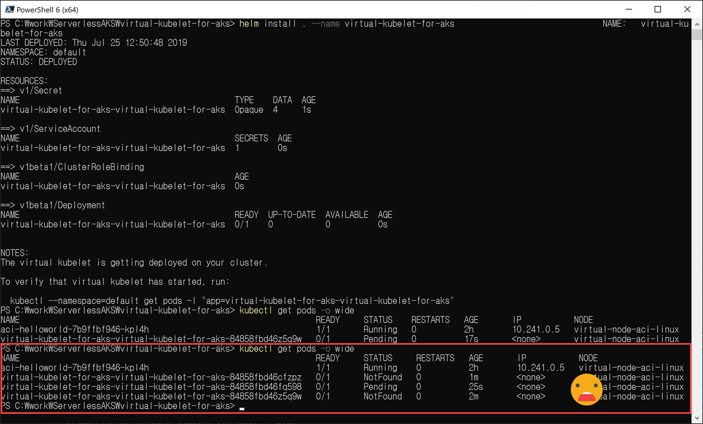
Do we give up? NO!
<br/>
Let's have a look at some logs. Especially the logs of the virtual-kubelet we have running already.
```
kubectl logs aci-connector-linux-7c789755b-z57dr --tail=10 --namespace kube-system
```
Mhh `unsupported fieldPath status.podIP` I searched for it and it is within the `deployment.yaml` a reference to the pods own IP address. Seems that the virtual-kubelet can not resolve this internal field. So I modified that part and included the podIP into the `values.yaml` and try to enter the IP the pod should be used to get (fast forward remark: that does not work as expected and maybe result in the last error we will face)
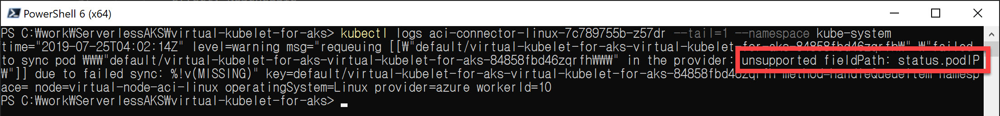
Here the change of the `deployment.yaml`
```
        - name: VKUBELET_POD_IP
          value: {{ .Values.env.podIP }}
          # valueFrom:
          #   fieldRef:
          #     fieldPath: status.podIP
```
Giving it a try again (I do the helm delete purge install vs upgrade because otherwise the _NotFound pods_ are displayed all the time):
```
helm del --purge virtual-kubelet-for-aks
helm install . --name virtual-kubelet-for-aks
```
Let's see... this time `ProviderFailed`
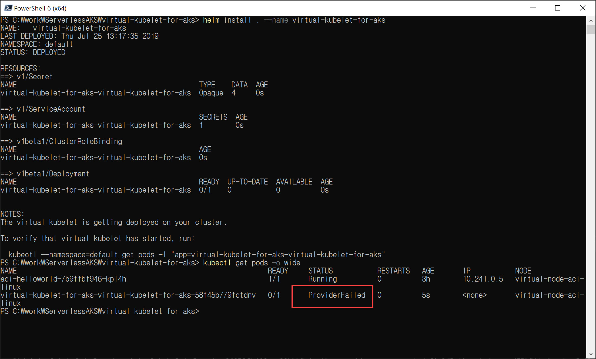

Having again a look at the logs of our virtual-kubelet in place, it says:<br/>
`requires volume acs-credential which is of an unsupported type`


If we are looking at the `deployment.yaml` again, we find the volume and the volume mount. Turns out that the AKS version of the virtual kubelet uses some configuration file which is automatically deployed/installed on the AKS nodes under `/etc/kubernetes/azure.json`.
```
        volumeMounts:
        - name: credentials
          mountPath: "/etc/virtual-kubelet"
        - name: acs-credential
          mountPath: "/etc/acs/azure.json"
        command: ["virtual-kubelet"]
        args: ["--provider", "azure", "--namespace", {{ default "" .Values.env.monitoredNamespace | quote }}, "--nodename", {{ default "virtual-kubelet" .Values.env.nodeName | quote }} , "--os", {{ default "Linux" .Values.env.nodeOsType | quote }} ]
      volumes:
      - name: credentials
        secret:
          secretName: {{ template "fullname" . }}
      - name: acs-credential
        hostPath:
          path: /etc/kubernetes/azure.json
          type: File
```
This finding was interesting because we get a direct dependency onto the AKS image & deploy mechanics of AKS. 
<br/><br/>
Shall we give up now? NO!!!
<br/><br/>
I had to decide:
1. Going back to non AKS version of virtual-kubelet, which possibly introduces other obstacles to run together with AKS 
2. Extract the file and build my own container image
I decided to follow up on the second option.
### Creating a container image
So actually this was easy. But it was spooky to find all the AKS credentials on the agent node...
I extracted the file from the node by using Azure Portal command execute capability.
```
cat /etc/kubernetes/azure.json
```
Which revealed following JSON:
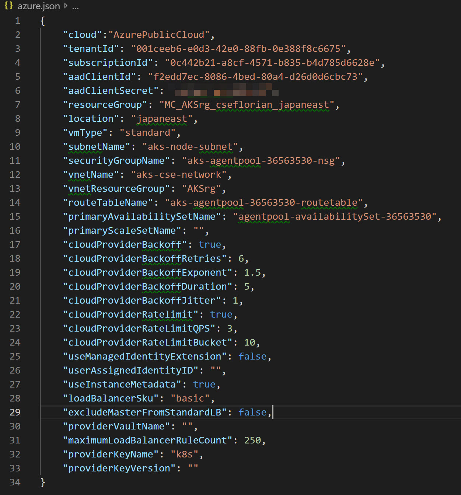
As you can see it includes the service principal and password of the AKS. You can get root access to the AKS with this... and it seems that you just can mount it within a pod/container? I hope I am missing something here. <br/>
But back to the mission, so there was no way to put that container into a public repo, so I created it within my private Azure Container Registry and added the credentials to the AKS.<br/>
```
kubectl create secret docker-registry h2flohacr --docker-server=h2floh.azurecr.io --docker-username=<> --docker-password=<>--docker-email=<>@microsoft.com
```
The Dockerfile needed to create the container image is:
```
FROM microsoft/virtual-kubelet

COPY azure.json /etc/acs/azure.json
```
And here the modified `deployment.yaml` including the private container registry credentials and decommenting the volume mount:
```
        volumeMounts:
        - name: credentials
          mountPath: "/etc/virtual-kubelet"
        # - name: acs-credential
        #   mountPath: "/etc/acs/azure.json"
        command: ["virtual-kubelet"]
        args: ["--provider", "azure", "--namespace", {{ default "" .Values.env.monitoredNamespace | quote }}, "--nodename", {{ default "virtual-kubelet" .Values.env.nodeName | quote }} , "--os", {{ default "Linux" .Values.env.nodeOsType | quote }} ]
      imagePullSecrets:
       - name: h2flohacr
      volumes:
      - name: credentials
        secret:
          secretName: {{ template "fullname" . }}
      # - name: acs-credential
      #   hostPath:
      #     path: /etc/kubernetes/azure.json
      #     type: File
```
Do not forget to change your `values.yaml` file with your new container image.

### Ready for another try?
Ok let's upgrade our helm deployment. 
```
helm upgrade virtual-kubelet-for-aks .
```
It will take some time until the pod appears in Running state. Cool. But does it work?

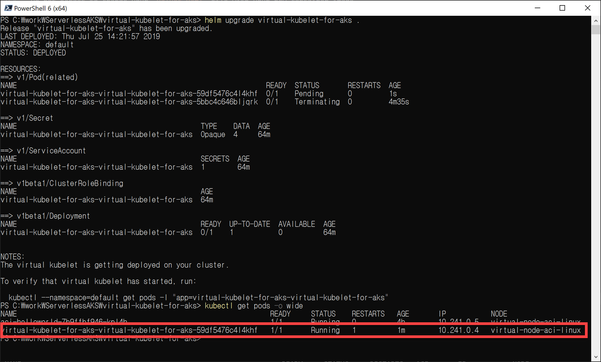

Additional virtual-node is there! Can we run a pod in it?

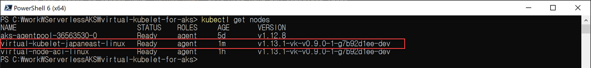

How to schedule a pod to the second virtual-node called `virtual-kubelet-japaneast-linux`?<br/>
Kubernetes provides a lot of ways to schedule pods on nodes all have to to with labeling and creating some key value pairs which have to match or the opposite.<br/><br/>

We could use the _nodeName_ selector, which is deprecated. The _nodeSelector_ and _toleration_. Actually the aci-helloworld example is already using _nodeSelector_ and _tolerations_ which working together with the virtual-kubelet. But how can we distinguish the 2 virtual nodes we have from each other?<br/><br/>

While you think of that, I will do the shortcut and `cordon` the first virtual-node, which does not allow any new deployments to be scheduled there.

```
kubectl cordon virtual-node-aci-linux
``` 

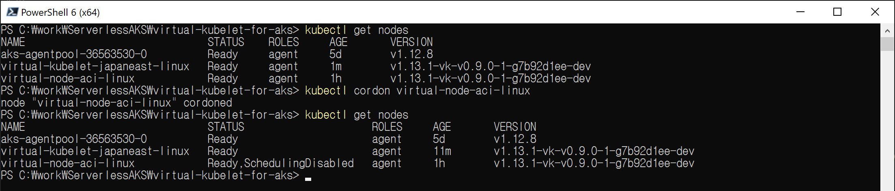

Delete and create again our test pod:
```
kubectl delete -f test.yaml
kubectl apply -f test.yaml
```
Looking good!!

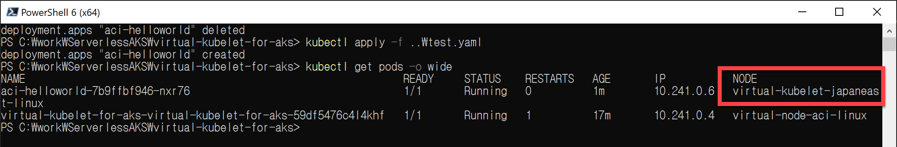


## Shutting down the node
Ok now, let's see if this will work out when draining the only available node.
```
kubectl drain aks-agentpool-36563530-0 --ignore-daemonsets --delete-local-data
```
Does not look good, the test pod is still running fine but the virtual-kubelet was rescheduled due to the loss of the virtual-node in which it was hosted. So we can not deploy any more pods in this configuration.
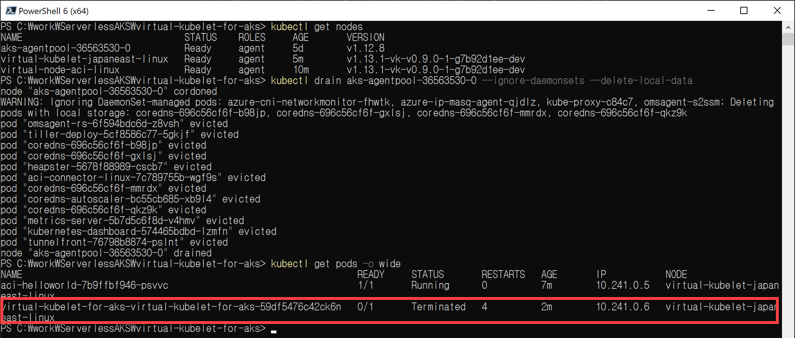

<br/><br/>
Now we please give up, right?, I have really work to do!!! NOOO!!!
<br/><br/>
What about hosting a virtual-kubelet in a virtual-kubelet in a virtual-node/kubelet?

#### Cleanup
For the next step we need the node to be back again so we `uncordon` it.
```
kubectl uncordon aks-agentpool-36563530-0
``` 
We should come back to a state where `aci-helloworld` and `virtual-kubelet` pods are again up and running on the virtual-node and for now remove the test pod as well.
```
kubectl delete -f ./test.yaml
``` 
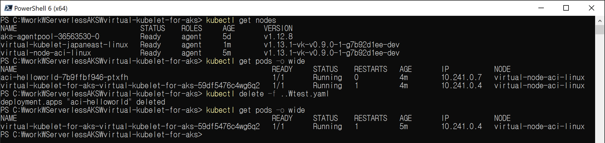

## How to deploy a virtual-kubelet in a virtual-kubelet on a virtual-node

Ok basically we did all the preperation.<br/>

We cordon the first virtual-node:
```
kubectl cordon virtual-node-aci-linux
``` 

We install the helm chart under another name and modify only the value for the k8s node name:
```
helm install . --name virtual-kubelet-for-aks-on-vk --set env.nodeName=vk-vk-japaneast-linux
```
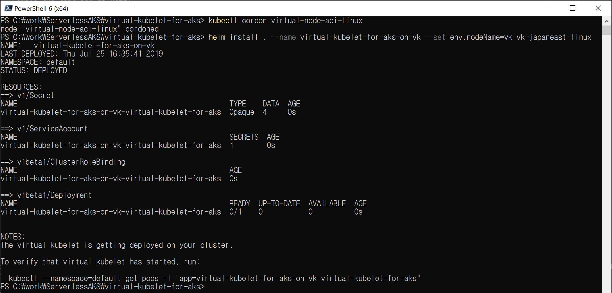

And voila we now have a virtual-kubelet running in a virtual-kubelet which is running in a virtual-kubelet (actually they are running all individual ACIs but that doesn't sound that cool).

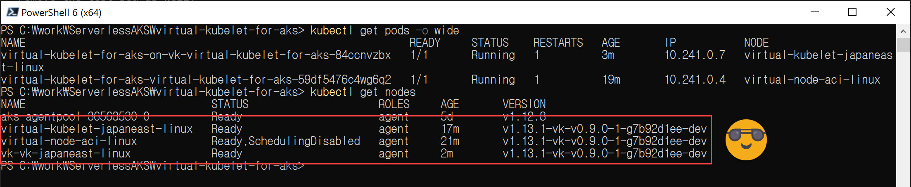

But does this change anything? Let's find out! <br/><br/> You believe me for know that if I force the test pod to be running on the most outer virtual-node, that it will work?! If not try out yourself!

### The last try?

So the chaining didn't work right. If I pushed the first domino brick the others fell also. 
Let's try to update the virtual-kubelet which is running in the first created virtual-node to run on the last created virtual-node.
```
kubectl cordon virtual-kubelet-japaneast-linux
helm upgrade virtual-kubelet-for-aks . --set env.podIP=10.241.0.8
```
Huii that worked!
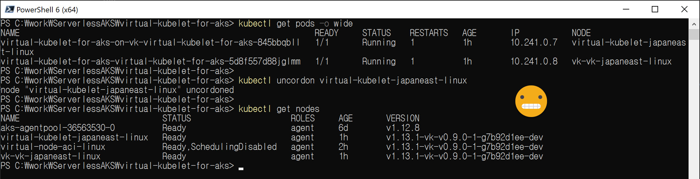

Ok now, let's see if this will work out when draining the only available node (again).
```
kubectl drain aks-agentpool-36563530-0 --ignore-daemonsets --delete-local-data
```

The virtual-nodes are still available and their controlling pods are running. We can see that all the pods from _kube-system_ namespace are still running or can not be rescheduled. We have a look at that later. 
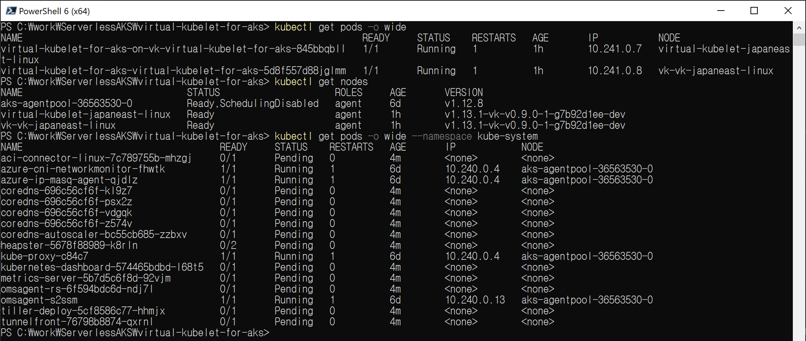

Let's go for sure and stop the node in Azure Portal and run the test pod.
```
az vm deallocate --resource-group MC_AKSrg_cseflorian_japaneast --name aks-agentpool-36563530-0
kubectl apply -f ..\test.yaml
```
Great! The AKS runs now completly serverless. But we also have to get all the system services scheduled/moved to the virtual-nodes...
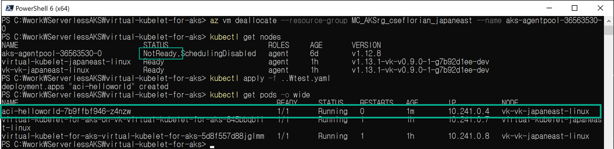

## Move pods in kube-system namespace

So we have now the virtual-nodes running but the pods in kube-system are still pending or off.
```
kubectl get pods -o wide --namespace kube-system
```
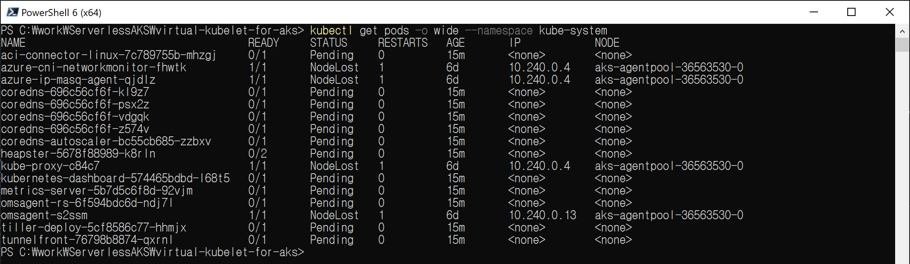

They are obvious not automatically rescheduled to the virtual-nodes. The reason is because this is how the virtual-nodes are designed. They are tainted that a pod does not get automatically scheduled on it, that is also why we had to change the virtual-kubelet `deployment.yaml` in the section [How to deploy virtual-kubelet on a virtual-node](##How-to-deploy-virtual-kubelet-on-a-virtual-node).
<br/><br/>
We normally do this because there are compatibility exceptions referenced [here](https://docs.microsoft.com/en-us/azure/aks/virtual-nodes-cli#known-limitations). And probably things that won't work, like we saw earlier e.g. mounting a file from the node/host.
Should have read that earlier, I did but ignored... <br/>Ok so obvious we will have no luck with the deamonsets, which is, if you think about it, logical because we do not have nodes anymore. We can not deploy several pods alongside the same virtual node (ACI supports container groups, but the virtual-kubelet does not, also we will have only one IP address per ACI).
<br/><br/>
Also to recall the controlling pod for the virtual-node is using the unmodified virtual-kubelet for aks with the host mounting parameter, so rescheduling this pod to one of our virtual-nodes will also fail.
<br/>
Ok, let's check what will go automatically if we untaint on of the virtual-nodes we have. So we remove the constraint of having a toleration at the deployment level of the pod.
<br/>
First have a look at the tain of one of our virtual-nodes:
```
kubectl get nodes vk-vk-japaneast-linux -o yaml
```
We see that there is one taint on it:
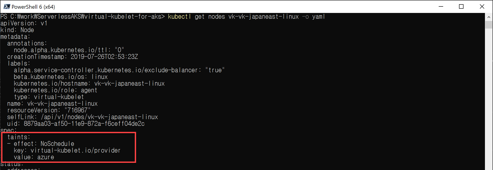

Let's delete the taint:
```
kubectl taint node vk-vk-japaneast-linux virtual-kubelet.io/provider:NoSchedule-
```
We see that not one single pod could be started or even scheduled to the virtual-node.<br/>
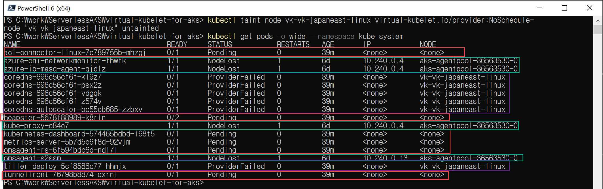

The aci-connector we already know that it won't work.<br/>
The NodeLost errors (green) are the deamon-sets.<br/>
The coredns pods probably fail because the use local-storage.<br/>
The other pending ones (red) we have to check the error log.<br/>
Ok, interesting that the tiller pod for helm is also not working. We go and have a look at this one.<br/>

### More time for investigation needed
We have to check the log for the corresponding virtual-kubelet pod which provides the virtual-node the tiller pod is scheduled to.
```
kubectl logs virtual-kubelet-for-aks-on-vk-virtual-kubelet-for-aks-845bbqbll --tail=10
```
This error does not feel good. We can not access the logs, maybe we messed to much with the podIP parameter? Seems to be important.
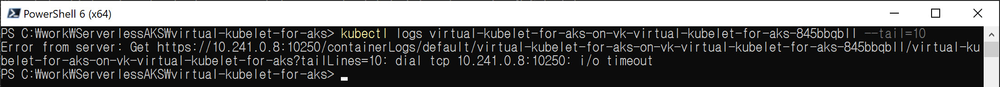
But we can try to access the logs directly from ACI by identifing the ACI which runs the pod, ACI name is default+podname:
```
az container logs --resource-group AKSrg --name default-virtual-kubelet-for-aks-on-vk-virtual-kubelet-for-aks-845bbqbll                       
```
So some time went by and now the bearer token can not be refreshed. Does not look good.
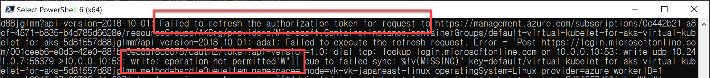

I deleted the test pod and try recreating it.
```
kubectl delete -f test.yaml
kubectl apply -f test.yaml
```
Ok, same error, so until the Bearer Token was valid after shutting down the node everything was fine but now we have some DNS or authentication problem. 
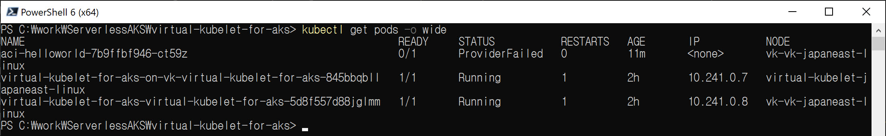

Do we give up? Yes, now my time to work on this runs out :D and I did something in the meantime where I lost motivation in investigating any further.

## Conclusion

If we are able to track down the authentication problem the Serverless AKS would probably work if we do not need certain feature sets not supported by ACI and if you can live without all the nice built-in features of AKS to send metrics and logs to Azure Monitor etc.<br/> Actually in a test run where I was faster to reschedule the tiller pod it just run fine on the virtual-node. I encountered the auth error while writing this summary.
<br/><br/>
The other reason I discontinued on it is I made a price comparison:
<br/>Turns out the node I used is if you run it 24/7 almost the same price as one ACI (1core, 1.5GB). But I can run a lot of pods on the one node but for each pod I need one ACI.

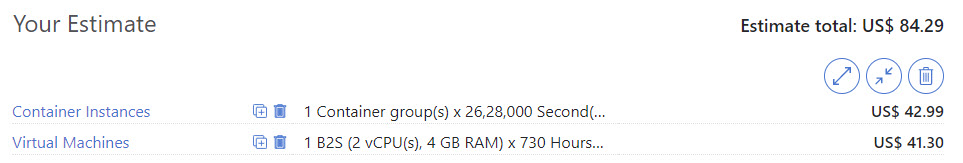

So Virtual-Node / Virtual-Kubelet is great to extend your AKS with Batch jobs or add one Windows Pod to a linux cluster. Or to extend it with a GPU! But a Serverless AKS based on Virtual-Kubelet is cumbersome and also not economically.<br/><br/>

The best tip I got was just deallocate your node if you just use your AKS for dev/test/upskill! 
<br/>**Thumps up for this Tip by Mani!**
